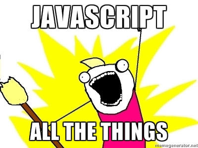

# JavaScript Introduction

## Agenda
* Brainstorm (What do you know about Javascript?
* History of Javascript
  
## History of Javascript

* Not to be confused with Java, but it is the baby child of Java syntax & Scheme principles
* Created in 10 days in May 1995 by [Brendan Eich](http://en.wikipedia.org/wiki/Brendan_Eich)
* It's an exciting time to learn Javascript! It's the language that enables web pages to respond to user interaction beyond the basic level.

## Why Javascript? 

* Javascript is one of the most popular programming languages in the world.  

Simple answer: We want high performance web sites!

*But what does this mean?*

- Javascript is the language that interacts with the DOM, a.k.a the browser.  
- We must use Javascript for any code we want to execute on the client side.  
- Sometimes executing code on the client side is faster.  
* Client side programming:
  * Interaction with the DOM
  * Respond to DOM events: click, submit...
  * Send requests to the server.
  * Acts on response from the server. 
 
## Resources:
* [Code School free course on the Developer Tools](https://www.codeschool.com/courses/discover-devtools)
* [JavaScript Alonge](https://leanpub.com/javascript-allonge/read#leanpub-auto-a-pull-of-the-lever-prefaces)
* [MDN JavaScript Reference](https://developer.mozilla.org/en-US/docs/Web/JavaScript/Reference)